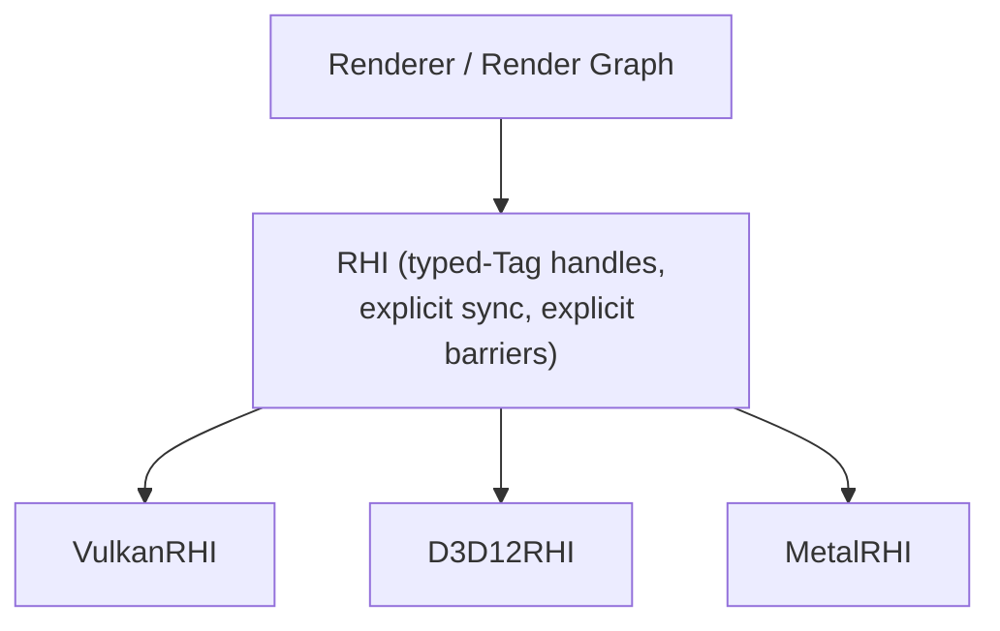
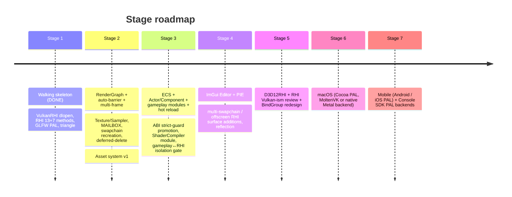

# practice-engine — Goal Architecture

This document describes the **target architecture** — what the engine looks like once every roadmap stage has landed. It is intentionally aspirational; current code does not yet meet every described capability. For what is actually built today see [`Stages/Stage1.md`](Stages/Stage1.md). For the decisions taken along the way see [`ADR/`](ADR/).

## 1. Vision

A C++20 modular game engine built on explicit modern GPU APIs (Vulkan first, D3D12 and Metal as siblings) with Unreal-style dynamic plugin loading. The non-negotiables:

- **RAII everywhere.** No naked `new`/`delete` in user-facing code. Every resource has a clear owner; lifetimes are visible at compile time.
- **No exceptions across module boundaries.** Failures are `EngineResult` codes or `ENGINE_FATAL`. Exceptions inside a `.cpp` are tolerated; across the C ABI they are forbidden.
- **Backends are swappable, not surveyed.** The same gameplay code should run unchanged when the renderer back-end swaps from Vulkan to D3D12, or when the PAL swaps from GLFW to native Win32.
- **Hot reload is a first-class concern.** Gameplay modules can be unloaded, recompiled, and reloaded while the engine keeps running — at Stage 3.

## 2. Layered overview

```mermaid
graph TD
    Gameplay["Game / Gameplay Modules<br/>(hot-reloadable)"]
    Editor["Editor<br/>(ImGui-based)"]
    RG["RenderGraph"]
    Renderer["Renderer"]
    RHI["RHI Interface"]
    VkRHI["VulkanRHI"]
    D3DRHI["D3D12RHI"]
    MtlRHI["MetalRHI"]
    AppCore["ApplicationCore (PAL)<br/>IPlatformApplication / IWindow / EKey"]
    Backends["GLFW · Win32 · Wayland · Cocoa · Console SDK<br/>(backends; one selected per build)"]
    Core["Core<br/>(log, assert, modules, ECS, paths)"]
    Launch["Launch (static bootstrap)"]

    Gameplay --> Editor
    Editor --> RG
    Gameplay -.NOT allowed: gameplay→RHI direct.-> RG
    RG --> Renderer
    Renderer --> RHI
    RHI --> VkRHI
    RHI --> D3DRHI
    RHI --> MtlRHI
    Renderer --> AppCore
    AppCore --> Backends
    AppCore --> Core
    VkRHI --> Core
    Renderer --> Core
    Launch --> Core
    Launch --> Renderer
    Launch -. dlopen .-> VkRHI
    Launch -. dlopen .-> AppCore
```



The dotted lines mark **runtime-only** edges (dlopen). All solid edges are link-time. The "gameplay must not reach RHI directly" rule becomes an enforced isolation gate at Stage 3.

See [ADR-0001](ADR/0001-modules-are-dynamically-loaded.md), [ADR-0002](ADR/0002-rhi-is-a-dynamically-loaded-module.md), [ADR-0005](ADR/0005-applicationcore-as-pal.md), [ADR-0014](ADR/0014-framework-philosophy-and-per-module-pch.md), [ADR-0018](ADR/0018-configure-time-pal-static-link.md), [ADR-0019](ADR/0019-backend-group-directories.md) for the reasoning behind each boundary.

## 3. Module system

Every module ships as a shared library (`.so` / `.dll`) with two `extern "C"` exports: `CreateModule_<Name>` and `DestroyModule_<Name>`. The host (Launch or any external embedder) discovers modules by name at runtime through `pe::ModuleLoader`.

**Long-term capability** (Stage 3+):

- `ModuleDescriptor` carries name, version, dependencies, `ELoadingPhase` (EarliestPossible → PostEngineInit), and a `hot_reloadable` flag.
- Dependency graph is topo-sorted within each phase; cross-phase dependencies are validated at manifest scan.
- Hot reload follows the documented state machine: drain frame → pre-reload → unregister systems → check schema → unload DLL → load new DLL → re-register → restore data → post-reload.
- Component data lives in Core's ECS archetype storage so gameplay modules can be swapped without losing state (handle-indirection pattern, not serialization round-trip).

**Stage 1 / 2 simplification:** none of the above. Linear dep graph, single Default phase, no hot reload. See Stage1.md for current capability.

## 4. RHI abstraction

The RHI is a thin, explicit, backend-neutral interface. It exposes resource creation, command list lifecycle, and explicit barrier emission. It does **not** auto-track resource state.



**Goal surface:**

- Resources via typed handles (`RHIHandle<Tag>`): Buffer, Texture, Sampler, Shader, Pipeline, BindGroup{Layout}, Fence, Semaphore, Swapchain, CommandList.
- Generation counter + deferred-delete queue (Stage 2) for bindless-friendly safe destruction.
- Timeline fences as the primary CPU↔GPU sync; binary semaphores reserved for the swapchain interop the OS forces on us.
- Multi-queue Submit (Graphics / Compute / Transfer).
- Bindless descriptor indexing (Stage 4+ once a real material system exists).

A **RenderGraph** layer (Stage 2) sits above the RHI and is the only thing that calls `ResourceBarrier`. The RHI never tracks state — auto-tracking is the central failure mode the Architect/Critic flagged in v1 ([ADR-0004](ADR/0004-render-graph-emits-barriers.md)).

Handle and surface decisions: [ADR-0003](ADR/0003-rhi-handle-model.md), [ADR-0008](ADR/0008-stage1-rhi-minimum-surface.md), [ADR-0013](ADR/0013-surface-creation-via-callback.md).

## 5. Platform Abstraction Layer (PAL)

`ApplicationCore` exposes `IPlatformApplication` + `IWindow` + `EKey`. Implementations live under `ApplicationCore/Private/<Backend>/`. The selected backend is a CMake-time choice (`ENGINE_APP_BACKEND`); only one backend compiles per build.

| Backend | Stage | Use case |
|---|---|---|
| GLFW | 1 | Walking skeleton; broad desktop coverage |
| SDL3 | optional Stage 3 | Game-class input (gamepad, touch), audio |
| Win32 | 4 | Editor's native dialogs + multi-window |
| Wayland / X11 | 6 (Linux native) | When GLFW's quirks become limiting |
| Cocoa | 6 | macOS native |
| Console SDK | 7 | Platform-vendor SDK on console |

External modules (Renderer, Launch, gameplay) see only `IPlatformApplication` / `IWindow`. They cannot reach GLFW or any other backend's headers. This is the invariant that lets us add or swap backends without rewriting consumers.

Rationale: [ADR-0005](ADR/0005-applicationcore-as-pal.md).

## 6. Game object model (Stage 3+)

Public API: Unreal-style `Actor` + `Component` (composition, no inheritance hierarchy for behavior). Storage: archetype ECS underneath, so per-system iteration is cache-friendly and parallelizable. The public API is what users write against; the ECS storage is what the engine schedules over.

Hybrid rationale: Unity DOTS demonstrated the value pattern (familiar object API, parallel data layout). UE's pure inheritance model loses to it on system parallelism; pure ECS loses to it on authoring ergonomics for designers.

Reflection comes from a yet-to-choose mechanism — UHT-equivalent likely emerging from `clang AST` or `magic_enum`/`refl-cpp` style libraries at Stage 4 when the editor's property grid needs it.

## 7. Editor (Stage 4+)

ImGui-based, in-process editor (PIE = Play-In-Editor). PIE reuses the editor's IRHIDevice but presents into an offscreen target that becomes one panel among many in the editor's docked layout. Editor-only RHI surface additions (multi-swapchain, offscreen render target) land at the same time.

Hot reload of gameplay modules (Stage 3) is what makes PIE worth shipping — without it the workflow is no better than restarting a game.

## 8. Cross-cutting principles

| Principle | Where enforced |
|---|---|
| RAII; no naked `new`/`delete` in user-facing code | clang-tidy + code review |
| No exceptions across module boundaries | `EngineResult` return + `ENGINE_FATAL` only inside modules |
| No STL types across module boundaries | `EngineStringView`/`EngineSpan<T>`/`IEngineAllocator` (Stage 1 declared, Stage 3 enforced via `#error`) — [ADR-0007](ADR/0007-abi-strict-guards-staged-promotion.md) |
| Renderer cannot reach Vulkan | G2/G3 gates — [ADR-0002](ADR/0002-rhi-is-a-dynamically-loaded-module.md) |
| RHI backends are dlopened, never linked | G1 gate — [ADR-0002](ADR/0002-rhi-is-a-dynamically-loaded-module.md) |
| PAL backends are configure-time STATIC-linked, interface separated | [ADR-0018](ADR/0018-configure-time-pal-static-link.md) (lifecycle differs from RHI on purpose; see ADR for why) |
| Backend modules grouped under `Platforms/` and `RHIBackends/` | [ADR-0019](ADR/0019-backend-group-directories.md) |
| Gameplay cannot reach RHI directly | Stage 3 isolation gate |
| External hosts use explicit per-module includes (`<Core/...>`, `<RHI/...>`, …); compile speed via per-module PCH | [ADR-0014](ADR/0014-framework-philosophy-and-per-module-pch.md) |

## 9. Goal directory layout

```
practice-engine/
├── CMakeLists.txt   CMakePresets.json   BUILDING.md   README.md
├── CMake/                     # shared CMake helpers
├── Engine/
│   ├── Source/
│   │   ├── Runtime/           # ships in the game
│   │   │   ├── Core/                  # logging, assert, modules, ECS, math, paths
│   │   │   ├── RHI/                   # backend-neutral interface (INTERFACE library)
│   │   │   ├── RHIBackends/           # group dir: runtime-dlopen RHI backends (ADR-0019)
│   │   │   │   ├── Vulkan/                # SHARED, dlopen-only (Stage 1)
│   │   │   │   ├── D3D12/                 # Stage 5
│   │   │   │   └── Metal/                 # Stage 6
│   │   │   ├── ApplicationCore/       # PAL interface (INTERFACE library)
│   │   │   ├── Platforms/             # group dir: configure-time PAL backends (ADR-0019)
│   │   │   │   ├── GLFW/                  # STATIC, Stage 1 default
│   │   │   │   ├── Win32/                 # Stage 4+
│   │   │   │   ├── Wayland/               # Stage 6
│   │   │   │   ├── Cocoa/                 # Stage 6
│   │   │   │   └── ConsoleX/              # Stage 7
│   │   │   ├── Renderer/              # Vulkan-headers-forbidden
│   │   │   ├── RenderGraph/           # Stage 2
│   │   │   ├── ShaderCompiler/        # Stage 3+
│   │   │   ├── Asset/                 # Stage 2+
│   │   │   ├── Launch/                # static bootstrap
│   │   │   └── Tests/                 # G5 + per-module smoke tests
│   │   ├── Editor/                    # Stage 4+
│   │   ├── Developer/                 # dev-only modules (profiler UI, …)
│   │   └── Programs/                  # standalone helper exes (ShaderCompiler driver, …)
│   └── Shaders/
├── Plugins/                  # third-party plugin trees (Stage 3+)
├── Samples/                  # HelloTriangle and successors
├── ThirdParty/               # FetchContent fallbacks (vendored only when necessary)
├── Saved/                    # runtime-generated (logs, screenshots) — gitignored
├── Binaries/<Platform>/<Config>/
└── Docs/
    ├── Architecture.md       # this file
    ├── Stages/               # per-stage execution plans
    └── ADR/                  # decision records
```

Stage 1 occupies a subset; later stages add new top-level entries (`Plugins/`, more `Runtime/*` modules, `Editor/`).

## 10. Roadmap



Per-stage plans live in [`Stages/`](Stages/). Stage acceptance is binary — every gate in the stage doc must pass.

## 11. Where to find things

| Looking for | Read |
|---|---|
| What the engine looks like at maturity | this file |
| What is actually built right now | [`Stages/Stage1.md`](Stages/Stage1.md) |
| What is planned next | [`Stages/README.md`](Stages/README.md) |
| Why a particular design choice was made | [`ADR/README.md`](ADR/README.md) → index |
| How to build & run | [`../BUILDING.md`](../BUILDING.md) |
| How to write a sample / embedder | [`../Samples/README.md`](../Samples/README.md) |
