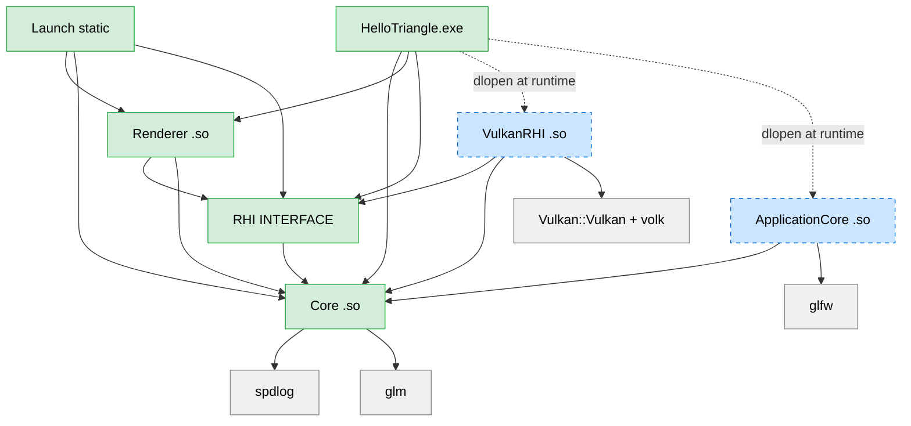

# Stage 1 — Walking Skeleton

**Status:** Complete.
**Headline goal (binary):** Running `HelloTriangle` opens a window in which a colored triangle is rendered through a runtime-`dlopen`-ed `VulkanRHI` module, while the Renderer module reaches no Vulkan symbol or header.

## What Stage 1 contains

The minimum set of modules + glue to satisfy the headline goal.

| Module | Path | Type | Stage 1 deps |
|---|---|---|---|
| Core | `Engine/Source/Runtime/Core/` | SHARED | spdlog, glm |
| RHI | `Engine/Source/Runtime/RHI/` | INTERFACE | Core |
| VulkanRHI | `Engine/Source/Runtime/VulkanRHI/` | SHARED (dlopen-only) | Core, RHI, Vulkan SDK, volk |
| ApplicationCore | `Engine/Source/Runtime/ApplicationCore/` | SHARED (dlopen-only) | Core, glfw (PRIVATE backend) |
| Renderer | `Engine/Source/Runtime/Renderer/` | SHARED | Core, RHI |
| Launch | `Engine/Source/Runtime/Launch/` | STATIC | Core, RHI, Renderer |
| HelloTriangle (sample) | `Samples/HelloTriangle/` | EXE | Core, RHI, Renderer (link); ApplicationCore (headers only — dlopened); VulkanRHI (dlopened) |
| DummyModule, dummy_module_smoke, rhi_smoke, app_smoke | `Engine/Source/Runtime/Tests/` | tests | varies |



## What Stage 1 intentionally omits (vs the Architecture.md goal)

The full list of "deferred to later stage" items, each tied to an ADR or to a later stage's section. Reading this list explains every divergence between current code and the goal architecture.

| Omitted | Where it goes | Rationale |
|---|---|---|
| `ELoadingPhase` enum, dependency graph, Tarjan SCC | Stage 3 | Six modules in a linear dep graph need no SCC ([ADR-0001](../ADR/0001-modules-are-dynamically-loaded.md)) |
| Module manifest scanning (`.uplugin`-equivalent) | Stage 3 | `LaunchEngineLoop` requests modules by name literal |
| Hot reload (`PreReload`/`PostReload`, shadow copy, state machine) | Stage 3 | No gameplay modules exist yet |
| ABI strict `#error` guards enforced | Stage 3 | All modules built with same compiler & CRT; risk surface is 0 ([ADR-0007](../ADR/0007-abi-strict-guards-staged-promotion.md)) |
| ECS archetype storage, Actor/Component | Stage 3 | No data model use case yet |
| RHI handle generation counter, deferred-delete | Stage 2 | Stage 1 uses `vkDeviceWaitIdle` on shutdown ([ADR-0003](../ADR/0003-rhi-handle-model.md)) |
| RHI methods: Compute, Indirect, BindGroup, MapBuffer, multi-queue Submit, debug labels | Stage 2-5 | Untested-interface lock-in avoided ([ADR-0008](../ADR/0008-stage1-rhi-minimum-surface.md)) |
| Timeline fence as primary sync | Stage 2 | 1 frame in flight only |
| RenderGraph (auto-barrier scheduling) | Stage 2 | Renderer hand-rolls 2 barriers ([ADR-0004](../ADR/0004-render-graph-emits-barriers.md)) |
| MAILBOX present mode, swapchain recreation on resize | Stage 2 | FIFO + fixed-size window (`GLFW_RESIZABLE=FALSE`) |
| `IShaderCompiler` module, HLSL+DXC | Stage 3+ | Build-time `glslc` is enough for one triangle ([ADR-0006](../ADR/0006-shaders-glsl-stage-1-hlsl-later.md)) |
| Full `EKey` enum | Stage 3 | Only `Unknown` + `Escape` needed ([ADR-0005](../ADR/0005-applicationcore-as-pal.md)) |
| ImGui Editor, PIE | Stage 4 | — |
| D3D12RHI, MetalRHI | Stage 5-6 | — |
| Mobile / console PAL backends | Stage 7 | — |

## Implementation checklist (§6.a → §6.f)

Each step independently committable. Solo full-time estimate per design: 4-6 weeks for the full Stage; actual elapsed in this session was ~1 day with the design pre-decided.

### §6.a — Repo scaffolding (complete)

- Root config: `CMakeLists.txt`, `CMakePresets.json`, `.editorconfig`, `.gitignore`, `.clang-format`, `.clang-tidy`, `README.md`, `BUILDING.md`.
- `CMake/`: `EngineModule.cmake` (`add_engine_module`/`add_engine_executable`), `CompilerWarnings.cmake`, `Platform.cmake`, `ThirdPartyDeps.cmake`, `check_no_vulkan_includes.sh`.
- Directory tree per Architecture.md §4.
- **Exit:** `cmake --preset linux-debug` succeeds with zero registered modules.

### §6.b — Core module + DummyModule for G5

- Public headers: `EngineAbi.hpp`, `Logging.h`, `Assert.h`, `Types.h`, `Module.h` (`IModule` + `DECLARE_ENGINE_MODULE`), `Paths.h`, `IEngineContext.h`, `ModuleLoader.h`, `MallocAllocator.h`.
- Private: `MallocAllocator.cpp`, `Logging.cpp` (spdlog stdout + rotating file), `Paths.cpp` (Win32 `GetModuleFileNameW` / Linux `/proc/self/exe`), `ModuleLoader.cpp` (cross-platform dlopen wrapper).
- `Tests/DummyModule/` — minimal `IModule` impl that prints from `Startup`/`Shutdown`.
- `Tests/dummy_module_smoke/` — host exe that dlopens DummyModule and verifies `GetName() == "Dummy"`.
- **Exit:** `dummy_module_smoke` exit 0; smoke test does NOT link DummyModule (ldd check).

### §6.c — RHI interface + VulkanRHI dlopen

- RHI module (INTERFACE library): `RHITypes.h`, `IRHICommandList.h`, `IRHIDevice.h`, `IRHIBackendModule.h`.
- VulkanRHI module (SHARED): `VulkanCommon.h`, `VulkanResourcePool.h`, `VulkanResources.h`, `VulkanDevice.{h,cpp}`, `VulkanCommandList.{h,cpp}`, `VulkanRHIModule.cpp`.
- Device selection: Vulkan 1.3 + `dynamicRendering` + `synchronization2` + unified graphics/present queue family ([ADR-0009](../ADR/0009-vulkan-1-3-baseline-no-fallback.md)).
- `VK_KHR_swapchain` device extension gated on caller's `create_surface` callback ([ADR-0012](../ADR/0012-swapchain-device-extension-gated.md)).
- `Tests/rhi_smoke/` — dlopens VulkanRHI, creates a headless device, `WaitIdle`, tears down.
- **Exit:** `rhi_smoke` exit 0; test exe does NOT link Vulkan/volk/VulkanRHI.

### §6.d — ApplicationCore PAL + GLFW backend ([ADR-0005](../ADR/0005-applicationcore-as-pal.md))

- Public PAL: `IPlatformApplication.h`, `IWindow.h`, `PlatformKey.h`.
- Private GLFW backend at `Private/GLFW/` (`GLFWBackend.h`, `GLFWWindow.cpp`, `GLFWApplication.cpp`).
- `IPlatformApplication::CreateGraphicsSurface(EGraphicsBackend::Vulkan, …)` bridges PAL ↔ VulkanRHI through opaque `void*` ([ADR-0013](../ADR/0013-surface-creation-via-callback.md), [ADR-0015](../ADR/0015-pal-graphics-backend-abstraction.md)).
- `GLFW_RESIZABLE=FALSE`, ESC-to-close, fixed 1280×720 (samples customize).
- `Tests/app_smoke/` — dlopens ApplicationCore, creates a window, pumps events for 60 frames, exits cleanly.
- **Exit:** `app_smoke` exit 0; test exe does NOT link ApplicationCore or GLFW.

### §6.e — Renderer draws a triangle

- Public: `Renderer/Renderer.h` (FRenderer with `Init(IRHIDevice&, IWindow&)` / `RenderFrame()` / `Shutdown()`).
- Private: `Renderer.cpp` — swapchain + shaders + pipeline + vertex buffer + per-frame command list cycle.
- Shaders: `Engine/Shaders/Private/Triangle.{vert,frag}.glsl`, compiled by `glslc` at build time via `add_custom_command` with `-fshader-stage=` derived from filename pattern.
- Per-image `render_finished` semaphore ([ADR-0011](../ADR/0011-per-image-render-finished-semaphore.md)).
- **Exit:** validation 0 errors across hundreds of frames; G2/G3 gates pass.

### §6.f — Launch + canonical host

- Launch (STATIC library): `LaunchEngineLoop.h`, `LaunchEngineLoop.cpp` — owns IEngineContext, loads ApplicationCore + VulkanRHI, runs the loop, tears down in reverse.
- v5 update: `practice-engine` exe removed; `Samples/HelloTriangle/` is the canonical runnable. v6 update: hosts use explicit per-module includes (`<Core/...>`, `<RHI/...>`, ...); compile speed via per-module PCH ([ADR-0014](../ADR/0014-framework-philosophy-and-per-module-pch.md), supersedes the `PEngine` umbrella in [ADR-0010](../ADR/0010-pengine-umbrella-module.md)).
- **Exit:** all G1-G5 gates pass against `HelloTriangle`.

## Verification gates (G1-G5)

All must pass. CI runs these on every commit.

### G1 — Host exe does NOT link VulkanRHI

```bash
# Linux
ldd Binaries/Linux/Debug/HelloTriangle | grep -qi vulkanrhi && echo FAIL || echo OK
# Windows
dumpbin /dependents Binaries\Win64\Debug\HelloTriangle.exe | findstr /i vulkanrhi && echo FAIL || echo OK
```

### G2 — `libRenderer.so` has no Vulkan symbols or library deps

```bash
nm -D Binaries/Linux/Debug/libRenderer.so | awk '$2=="T" || $2=="U"' | grep -qE ' vk[A-Z]' && echo FAIL || echo OK
ldd Binaries/Linux/Debug/libRenderer.so | grep -qi vulkan && echo FAIL || echo OK
# Windows
dumpbin /imports Binaries\Win64\Debug\Renderer.dll | findstr /i vulkan && echo FAIL || echo OK
```

### G3 — Renderer sources do not include Vulkan headers

```bash
./CMake/check_no_vulkan_includes.sh
```

### G4 — Validation ERROR count over a real run

`HelloTriangle` runs with the validation layer enabled in Debug. The `DebugCallback` in `VulkanDevice.cpp` calls `ENGINE_FATAL` on any ERROR-severity message; a clean run that ends without `ENGINE_FATAL` is the proof. The log file is the auditable record:

```bash
grep -c '\[VK_ERROR\]' Saved/Logs/engine.log   # must be 0
grep -c '\[VK_WARNING\]' Saved/Logs/engine.log # reported, not gated
```

### G5 — Module loader regression

```bash
./Binaries/Linux/Debug/dummy_module_smoke && echo OK || echo FAIL
```

## Acceptance (binary go/no-go)

All true → Stage 1 done:

1. `HelloTriangle` runs on Linux with the Vulkan validation layer enabled.
2. A window opens, displays a colored triangle, closes cleanly on ESC/X.
3. G1, G2, G3, G4, G5 all pass.
4. `rhi_smoke`, `app_smoke`, `dummy_module_smoke` all exit 0.

## Solo-time accounting (post-hoc)

| § | Design estimate | Actual session time | Notes |
|---|---|---|---|
| 6.a | 2-3 days | ~30 min | Mostly typing |
| 6.b | 5-7 days | ~45 min | Win32 path skipped (Linux-only env) |
| 6.c | 7-10 days | ~1 hour | Mostly typing; volk + 1.3 features + slot pool came out cleanly |
| 6.d | 3-4 days | ~30 min | GLFW3 native-handle dispatch worked first try |
| 6.e | 7-10 days | ~1.5 hours | Per-image semaphore bug + glslc stage flag were the only surprises |
| 6.f | 3-5 days | ~30 min | Surface bridge thunk was the only subtle bit |

Original 27-39 day estimate accounted for first-time-with-Vulkan friction. This session had the design pre-decided and a Vulkan-1.4 driver available.
