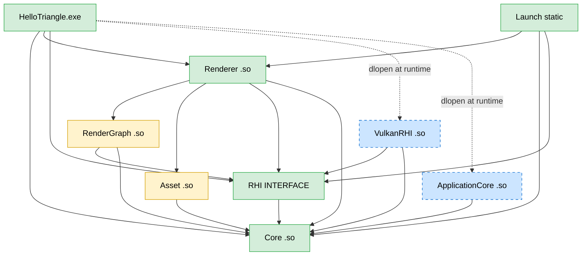

# Stage 2 — RenderGraph + Multi-frame

**Status:** Planned.
**Headline goal (binary):** `HelloTriangle` runs in a resizable window rendering a two-pass frame driven by **RenderGraph-computed barriers** under N-frames-in-flight with timeline-semaphore sync: a **ScenePass** draws the triangle into an offscreen color+depth Texture, and a **CompositePass** samples that color Texture through a Sampler into the swapchain. On window resize the swapchain and offscreen targets recreate; on shutdown resources are reclaimed by deferred-delete with no per-frame `vkDeviceWaitIdle`. The Renderer and RenderGraph reach no Vulkan symbol or header.

This stage promotes the Stage 1 simplifications (two hand-rolled barriers, one frame in flight, `vkDeviceWaitIdle` teardown, fixed-size FIFO, Buffer-only resources) into a structure a real frame can carry. It is the [Architecture.md §10](../Architecture.md) "RenderGraph + auto-barrier + multi-frame" slice.

## What Stage 2 contains

Two new modules plus a substantial RHI surface expansion. The canonical frame is a **two-pass sampling composite**: `ScenePass → offscreen (color + depth) → CompositePass (sample) → swapchain`. This deliberately exercises Texture (color + depth render targets), Sampler (composite read), RenderGraph (multi-pass auto-barrier scheduling), and a minimal descriptor path — every new API has a real caller (the ADR-0008 ethos).

| Module | Path | Type | Stage 2 change |
|---|---|---|---|
| **RenderGraph** (new) | `Engine/Source/Runtime/RenderGraph/` | SHARED | Sits above the RHI; **the only caller of `ResourceBarrier`**. Vulkan-headers-forbidden (G2/G3 extended) |
| **Asset** (new) | `Engine/Source/Runtime/Asset/` | SHARED | Synchronous blob/SPIR-V loading v1; absorbs the Renderer's ad-hoc `LoadShaderBytes` |
| RHI | `Engine/Source/Runtime/RHI/` | INTERFACE | Handle widened to 64-bit; Texture/Sampler/Barrier/SubmitInfo types; `TransitionTo*` removed |
| VulkanRHI | `Engine/Source/Runtime/RHIBackends/Vulkan/` | SHARED | Timeline semaphores, deferred-delete, textures/samplers/descriptors, swapchain recreation |
| Renderer | `Engine/Source/Runtime/Renderer/` | SHARED | Rewritten to build a graph; owns acquire/present; loads shaders through Asset |
| ApplicationCore + GLFW | `.../ApplicationCore/`, `Platforms/GLFW/` | INTERFACE / STATIC | `IWindow` resize signal; `GLFW_RESIZABLE=TRUE` |

`RenderGraph` and `Asset` depend only on `Core` and `RHI` — neither may reach a Vulkan symbol or header (G2/G3 cover both).

## What Stage 2 intentionally omits (vs the Architecture.md goal)

| Omitted | Where it goes | Rationale |
|---|---|---|
| Bindless descriptor indexing | Stage 4 | No material system yet ([Architecture §4](../Architecture.md)) |
| Async compute / multi-queue `Submit` | later | One graphics queue suffices; RenderGraph holds no queue knowledge yet ([ADR-0023](../ADR/0023-render-graph-minimum-scope.md)) |
| RenderGraph resource aliasing / transient memory pool | later | Two passes have no memory pressure ([ADR-0023](../ADR/0023-render-graph-minimum-scope.md)) |
| Asset cooking / streaming / async / image decoders | Stage 3+ | v1 is synchronous blobs only; the justifying consumer is SPIR-V loading ([ADR-0025](../ADR/0025-asset-system-v1-scope.md)) |
| Full `BindGroup{Layout}` (root-signature alignment) | Stage 5 | Redesigned when the D3D12 backend forces root-signature alignment ([ADR-0024](../ADR/0024-minimal-texture-binding.md), [Architecture §4](../Architecture.md)) |
| Hot reload / ECS / gameplay modules | Stage 3 | No gameplay modules exist ([Architecture §3, §6](../Architecture.md)) |
| HLSL+DXC `ShaderCompiler` module | Stage 3+ | Build-time `glslc` is enough ([ADR-0006](../ADR/0006-shaders-glsl-stage-1-hlsl-later.md)) |

## RHI surface changes (additive, plus one documented break)

### Handle widening ([ADR-0021](../ADR/0021-handle-generation-and-deferred-delete.md))

`RHIHandle<Tag>` widens from 32 to 64 bits: `{ uint32 index; uint32 generation; }`. New tags `TextureTag`, `SamplerTag`. `TResourcePool` carries a per-slot generation — `Insert` returns `{index, generation}`, `Get`/`Remove` assert the generation matches, `Remove` bumps it so a stale handle is a Debug FATAL. Index 0 stays the invalid sentinel.

### New value types (`RHITypes.h`)

- `RHITextureHandle`, `RHISamplerHandle`.
- `enum class ERHIResourceState { Undefined, RenderTarget, DepthAttachment, ShaderResource, CopySrc, CopyDst, Present }`.
- `struct RHIResourceBarrier { RHITextureHandle texture; ERHIResourceState before, after; }`. The swapchain image is treated as a texture via `device->GetSwapchainImageTexture(swapchain, image_index)`, which returns a **borrowed** `RHITextureHandle`. Borrowed-texture lifecycle rules ([ADR-0021](../ADR/0021-handle-generation-and-deferred-delete.md) / [ADR-0026](../ADR/0026-swapchain-recreation-and-resize.md)):
  1. The wrapper pool slot is allocated at swapchain create/recreate, **not** per `GetSwapchainImageTexture` call (per-call allocation leaks `TResourcePool` slots — `Remove` only marks `Destroyed`, never produces a reusable `Free` slot).
  2. `Destroy` on an external texture is **non-owning** — it must not `vkDestroyImage` the swapchain-owned `images[]` (borrowed), only the wrapper view/slot.
  3. On recreation (§6.f) the `VkImage`s change, so the wrapper's generation bumps and consumers must re-fetch; never cache a swapchain-texture handle across a recreate.
- `RHITextureDesc { uint32 width, height; ERHIFormat format; ERHITextureUsage usage; }` (usage is a bitmask: `RenderTarget | DepthStencil | Sampled | CopySrc | CopyDst`).
- `RHISamplerDesc { min/mag filter; address mode; mipmap mode }`.
- `ERHIFormat` gains a depth format (`D32_SFLOAT`).
- `RHIGraphicsPipelineDesc` gains a **descriptor-layout field** (`EngineSpan<const RHIDescriptorBinding>`, slot + kind = combined image sampler). The Stage 1 pipeline layout is empty; CompositePass cannot express "samples one texture" without it.
- `RHISubmitInfo { EngineSpan<const RHISemaphore> wait; EngineSpan<const RHISemaphore> signal; uint64 timeline_signal_value; }` (see Submit contract below).

### Submit synchronization contract ([ADR-0027](../ADR/0027-submit-sync-contract.md))

**`Submit`'s signature changes.** Today `Submit` discovers which swapchain's binary semaphores to thread through a side channel (`FVulkanCommandList::BoundSwapchain()`, set inside `TransitionToRenderTarget`). Removing `TransitionTo*` (§6.c) deletes that carrier, so "keep the signature" is impossible — and `ResourceBarrier` records a layout transition *into the command buffer*, which never touches `vkQueueSubmit`'s `pWait/pSignalSemaphores` (a different layer).

- `Submit(RHICommandListHandle, const RHISubmitInfo& sync)`.
- The **Renderer**, which owns acquire/present, fills the binary `image_available` (wait) and `render_finished` (signal) only on the boundary submit that writes the swapchain; interior pass submits pass timeline values only.
- The Renderer obtains those binary semaphores through new device accessors: `AcquireNextSwapchainImage` returns `RHIAcquiredImage { uint32 image_index; RHISemaphore image_available; }`, and `RHISemaphore GetRenderFinishedSemaphore(swapchain, image_index)`.

This decouples `Submit` from the swapchain without reviving the side channel, gives a coherent ownership model (the present-owner supplies present sync), and is the shape D3D12/Metal backends want.

### `IRHIDevice` new methods (additive)

`CreateTexture`, `CreateSampler`, `Destroy(RHITextureHandle)`, `Destroy(RHISamplerHandle)`, `GetSwapchainImageTexture`, `GetRenderFinishedSemaphore`, `RecreateSwapchain`. `AcquireNextSwapchainImage` return type changes to `RHIAcquiredImage`. `Submit` gains the `RHISubmitInfo` parameter.

### `IRHICommandList` changes

- **Removed (documented break):** `TransitionToRenderTarget` / `TransitionToPresent` — the Stage-1-only API predicted by [ADR-0004](../ADR/0004-render-graph-emits-barriers.md) / [ADR-0008](../ADR/0008-stage1-rhi-minimum-surface.md). One call site (`Renderer.cpp`).
- **Added:** `ResourceBarrier(EngineSpan<const RHIResourceBarrier>)`; `SetTexture(uint32 slot, RHITextureHandle, RHISamplerHandle)` (minimal combined-image-sampler path).
- `RHIRenderPassBeginInfo` generalizes: the swapchain-specific fields become an array of color-attachment texture handles + an optional depth texture handle + clear values. CompositePass targets the swapchain image obtained via `GetSwapchainImageTexture`.

### Multi-frame + deferred-delete ([ADR-0020](../ADR/0020-timeline-semaphores-primary-sync.md) / [ADR-0021](../ADR/0021-handle-generation-and-deferred-delete.md))

`MAX_FRAMES_IN_FLIGHT = 2`, a per-frame command pool/buffer ring. CPU↔GPU sync and frame pacing use a **timeline semaphore** (core in the 1.3 baseline, no extension gating — [ADR-0009](../ADR/0009-vulkan-1-3-baseline-no-fallback.md)); binary semaphores survive only at the swapchain boundary. Frame N waits until the timeline reaches `N − MAX_FRAMES_IN_FLIGHT` before reusing a frame slot — no `vkDeviceWaitIdle` in the steady loop. `Destroy(handle)` enqueues the payload stamped with the current `frame_value_`; it is reclaimed once the timeline passes that value.

## Implementation checklist (§6.a → §6.g)

Each step independently committable; the build is green and the relevant gates pass at every slice boundary. Order puts the handle/Submit foundation first (everything depends on it) and the descriptor/sampling work last (the most trimmable).

### §6.a — Handle generation counter (use-after-free detection only)

Widen `RHIHandle` to 64-bit; add a per-slot generation to `TResourcePool`. Public surface unchanged beyond handle width — the Stage 1 `WaitIdle` loop still holds. **Deferred-delete implementation moves to §6.b**: its key is the timeline, and the Stage 1 loop still `WaitIdle`s, so §6.a has nothing to drain against.

**Exit:** `rhi_smoke` and `HelloTriangle` still run; a new unit test destroys + re-allocates a slot and confirms the stale (generation-mismatched) handle is rejected (Debug FATAL).

### §6.b — Timeline-semaphore multi-frame + Submit contract + deferred-delete

Replace the binary frame fence with a timeline semaphore; `MAX_FRAMES_IN_FLIGHT = 2`; per-frame command-buffer ring; **move acquire/present ownership to the Renderer** and add the swapchain-semaphore accessors (`AcquireNextSwapchainImage → RHIAcquiredImage`, `GetRenderFinishedSemaphore`); **switch `Submit` to the `RHISubmitInfo` contract** (the boundary submit's binary semaphores come from those accessors via the new parameter, not from any residual `BoundSwapchain` channel — the param-driven `Submit` is established *before* §6.c deletes `TransitionTo*`); implement the frame-value-keyed deferred-delete queue. §6.b ↔ §6.c are coupled: deleting `TransitionTo*` forces the new Submit contract, so the contract lands here first.

**Exit:** the steady loop has no per-frame `vkDeviceWaitIdle`; the boundary submit receives its semaphores via `RHISubmitInfo` (not a side channel); validation 0; **G8 passes** — the outstanding-frame counter reaches 2 before timeline value 1 is signaled.

### §6.c — Texture/Sampler resources + generalized render pass + `ResourceBarrier`

Add Texture/Sampler handles, descs, and payloads (`VulkanTexturePayload` / `VulkanSamplerPayload`), Create/Destroy, and `GetSwapchainImageTexture`. Add `ResourceBarrier(span)` + `ERHIResourceState`; remove `TransitionTo*`; generalize `RHIRenderPassBeginInfo` to texture attachments (color + depth). The Renderer is temporarily updated to keep drawing a single pass into the swapchain texture via the new barrier API.

**Exit:** a texture create + transition smoke test is validation-clean; G1–G6 do not regress.

### §6.d — RenderGraph module (auto-barrier scheduler)

New SHARED module: declarative pass I/O (resource handles + read/write states), topological ordering, computed barrier schedule emitted via `ResourceBarrier`. The Renderer is rewritten to build the graph; ScenePass renders the triangle into the offscreen color + depth textures.

**Exit:** G2/G3 extended to RenderGraph (no Vulkan); validation 0 across the graph; a barrier-introspection log prints the inferred barriers per pass.

### §6.e — Sampling CompositePass + minimal descriptor path

Add the descriptor-layout field to `RHIGraphicsPipelineDesc`; `SetTexture(slot, tex, sampler)` combined image sampler; a fullscreen composite pipeline that samples the offscreen color into the swapchain. **Static descriptor set** ([ADR-0024](../ADR/0024-minimal-texture-binding.md)): the combined-image-sampler set is allocated and updated when the offscreen target is (re)created and only bound each frame — **never per-frame updated** (a per-frame update would need a descriptor ring to avoid mutating a set frame N still reads, exactly the ballooning this stage avoids).

**Exit:** the triangle is visible through the composite; validation 0; the offscreen texture is sampled.

### §6.f — MAILBOX present + swapchain recreation on resize

Present-mode selection (MAILBOX → Immediate → FIFO fallback) with a log line; `IWindow` resize signal (`ConsumeResized()`), a GLFW framebuffer-size callback flag, `GLFW_RESIZABLE=TRUE`; on out-of-date/suboptimal or resize, `RecreateSwapchain` plus offscreen-target recreation.

**Exit:** resizing the window keeps rendering, validation 0; MAILBOX is selected when supported (log).

### §6.g — Asset system v1

New Asset module: synchronous blob/SPIR-V loading, a path→AssetId registry, an in-memory cache; the Renderer routes shader loads through Asset (no direct `ifstream`).

**Exit:** shaders load through Asset; a test loads a known file and verifies size/bytes.

## Verification gates (Stage 2)

All must pass; G1–G6 must not regress. CI runs these on every commit.

- **G1–G6:** unchanged and still passing. Extend the G2/G3 "no Vulkan symbols/headers" coverage to the **RenderGraph and Asset** modules.
- **G7 — RenderGraph barrier correctness:** run the two-pass graph with validation (including synchronization2 validation) enabled for hundreds of frames → 0 `VK_ERROR`.
- **G8 — Multi-frame in flight:** no `vkDeviceWaitIdle` in the steady loop; two instruments, both grep-able log lines. **Structural (pass condition):** the slot-reuse wait for frame V targets timeline value `V − MAX_FRAMES_IN_FLIGHT` — logged as `[frames_in_flight] window=2` and Debug-asserted; an off-by-one here (waiting `V−1`) is the silent-serialization failure ADR-0020 calls out, and this catches it deterministically. **Observed (informational):** a "submitted-but-timeline-not-yet-signaled" counter logged as `[frames_in_flight] peak=N`. *Implementation note:* `peak ≥ 2` only materializes when GPU frame time exceeds the CPU submit gap; with the Stage 2 microsecond triangle scene under vsync (or a CPU-blocking acquire, as on Wayland+NVIDIA) the GPU is never a full frame behind, so `peak=1` is the physically correct reading — the observed counter becomes a meaningful gate once scenes carry real GPU load (Stage 3+).
- **G9 — Deferred-delete + generation:** destroy a live resource without `WaitIdle`, continue N frames → validation 0; using a stale (destroyed) handle is a generation-mismatch Debug FATAL.
- **G10 — Swapchain recreation:** a programmatic resize (or forced out-of-date) keeps rendering, resizes the offscreen targets, validation 0.
- **G11 — MAILBOX:** when the device reports MAILBOX support it is selected (log assert); on a FIFO-only surface it falls back cleanly (no error).
- **G12 — Texture sampling (headline, objective check required):** validation-clean is not sufficient (a wrong texture, black target, or mis-bound descriptor is also validation-clean). **Mandatory pixel readback:** render a known marker (e.g. a solid color or single-texel pattern) into the offscreen color target, sample it in CompositePass, read back one swapchain pixel, and assert its RGBA against the expected value. (Alternative: a reference image committed to the repo + a non-optional screenshot diff.)
- **G13 — Asset v1:** load a known file synchronously through Asset; the bytes match the on-disk size/hash; the Renderer's shader path goes through Asset (no direct `ifstream` in the Renderer).

## Acceptance (binary go/no-go)

All true → Stage 2 done:

1. `HelloTriangle` visibly renders the triangle through the two-pass sampling graph (validation layer enabled, 0 ERROR).
2. Resizing the window keeps rendering correctly (swapchain + offscreen recreate).
3. The steady loop has no per-frame `vkDeviceWaitIdle` (timeline multi-frame); shutdown reclaims via deferred-delete.
4. G1–G13 all pass (including no G1–G6 regression).
5. `rhi_smoke`, `app_smoke`, `dummy_module_smoke` still exit 0.

## Stage 2 ADRs

| # | Title |
|---|---|
| [0020](../ADR/0020-timeline-semaphores-primary-sync.md) | Timeline semaphores as primary CPU↔GPU sync; binary semaphores only for swapchain interop |
| [0021](../ADR/0021-handle-generation-and-deferred-delete.md) | Handle generation counter + deferred-delete queue (handle widened 32→64-bit) |
| [0022](../ADR/0022-resource-barrier-replaces-transition.md) | `ResourceBarrier(span)` + `ERHIResourceState` replaces Stage-1-only `TransitionTo*` |
| [0023](../ADR/0023-render-graph-minimum-scope.md) | RenderGraph minimum scope — declarative pass I/O + topo schedule; no aliasing/async-compute/multi-queue |
| [0024](../ADR/0024-minimal-texture-binding.md) | Minimal texture binding (single static descriptor set, combined image sampler); bindless deferred to Stage 5 |
| [0025](../ADR/0025-asset-system-v1-scope.md) | Asset system v1 scope — synchronous, in-memory, no cooking/streaming/decoders |
| [0026](../ADR/0026-swapchain-recreation-and-resize.md) | Swapchain recreation + `IWindow` resize signaling; Renderer owns acquire/present, RenderGraph owns barriers |
| [0027](../ADR/0027-submit-sync-contract.md) | Submit sync contract — explicit `RHISubmitInfo`; binary semaphores supplied by Renderer only at the boundary submit |
